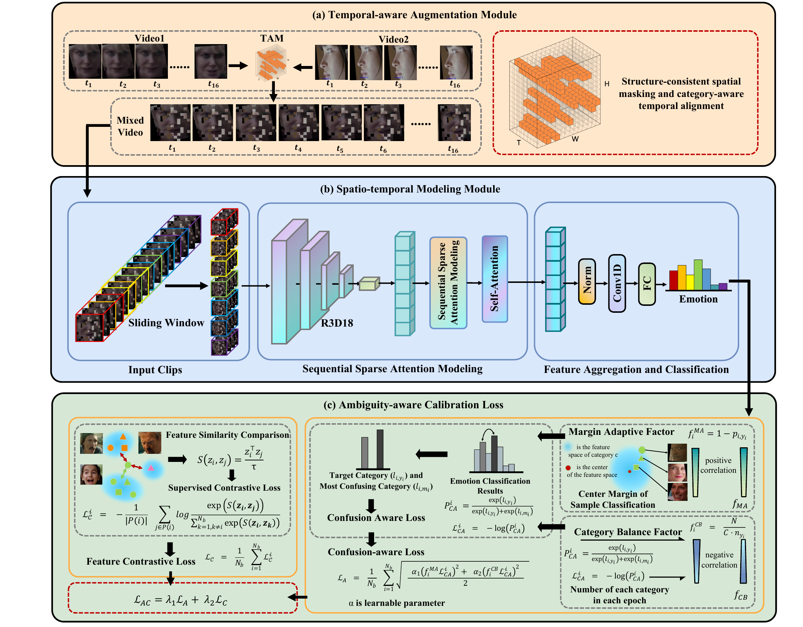

# [IEEE TIFS'26]Toward Trustworthy Dynamic Facial Expression Recognition via Information Bottleneck Modeling

The core code of this paper has been made open source.

## Abstract

Due to the presence of semantic ambiguity among similar expression categories and the inherent imbalance in spatio-temporal feature intensities, dynamic facial expression recognition (DFER) in the wild poses significant challenges for building trustworthy and robust systems. These factors often lead to inconsistent feature representations and unreliable decision boundaries, which hinder the model's ability to perform stable and accurate recognition under uncertainty, and further pose a serious safety hazard, e.g., misdiagnosis of depression. To tackle these challenges, we propose a novel adaptive framework, Semantic-Aware Facial Expression Recognition framework (SAFE), which is developed from an Information Bottleneck (IB)-inspired perspective to improve the robustness and prediction reliability of DFER in complex, unconstrained scenarios. Specifically, we first design a Temporal-aware Augmentation Module (TAM) to introduce structurally perturbed yet temporally coherent training samples, effectively mitigating spatio-temporal feature imbalance. Then, to ensure stable long-range modeling under temporal variation, we introduce the Spatio-temporal Modeling Module (STM) with a sparsity-aware state-space fusion gate. Furthermore, an Ambiguity-aware Calibration Loss (ACL) is formulated to dynamically refine decision boundaries by focusing on confusing and underrepresented categories, improving the model's resilience to distributional skew and semantic uncertainty. Extensive experiments on two large-scale in-the-wild DFER benchmarks, DFEW and FERV39k, demonstrate that SAFE consistently outperforms state-of-the-art methods across multiple metrics, particularly under ambiguous and imbalanced conditions. These results validate the effectiveness of our approach in promoting more robust and stable expression recognition, which is important for trustworthy DFER in real-world environments. Codes are released at https://github.com/QIcita/SAFE_DFER.

## Acknowledgments

The project is designed on [DFEW](https://github.com/jiangxingxun/DFEW), [FERV39k](https://github.com/wangyanckxx/FERV39k), and [M3DFEL](https://github.com/Tencent/TFace/blob/master/attribute/M3DFEL/README.md), thanks to these works!
